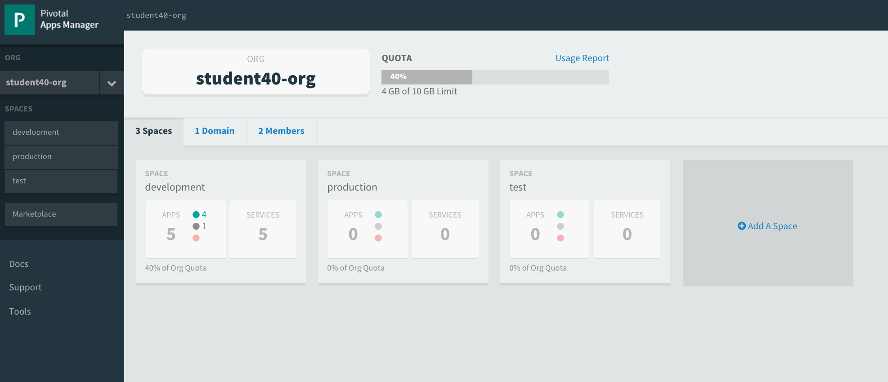
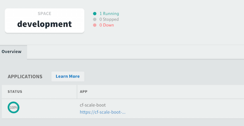
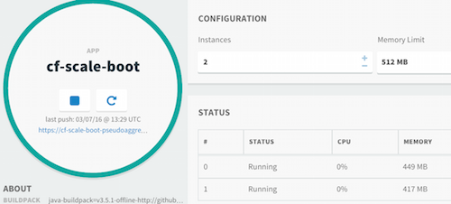
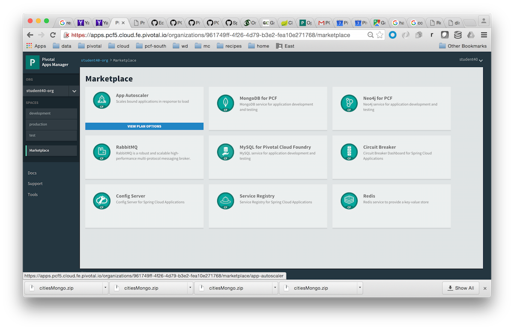
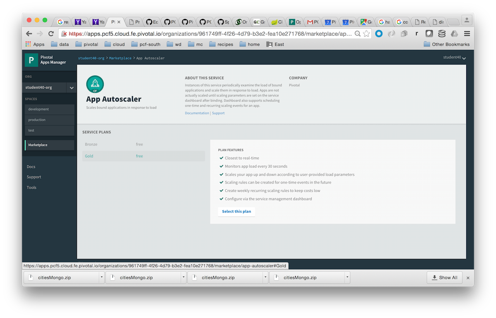
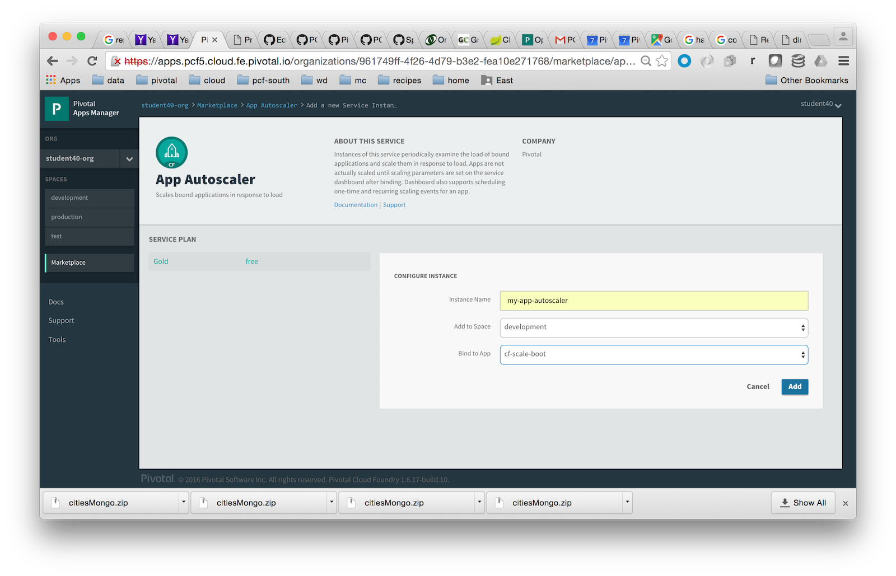
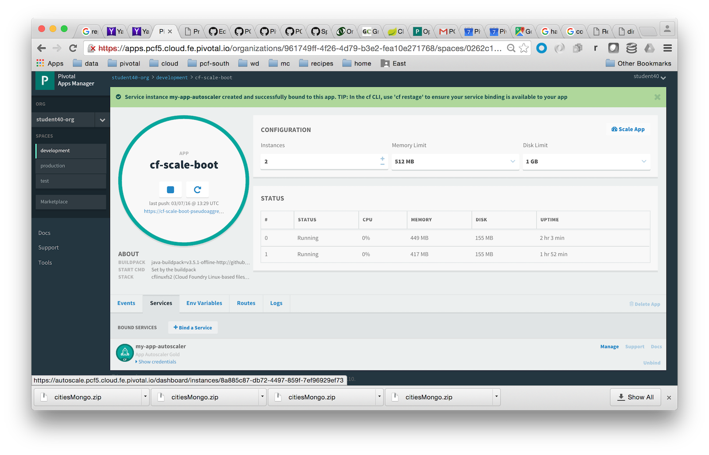
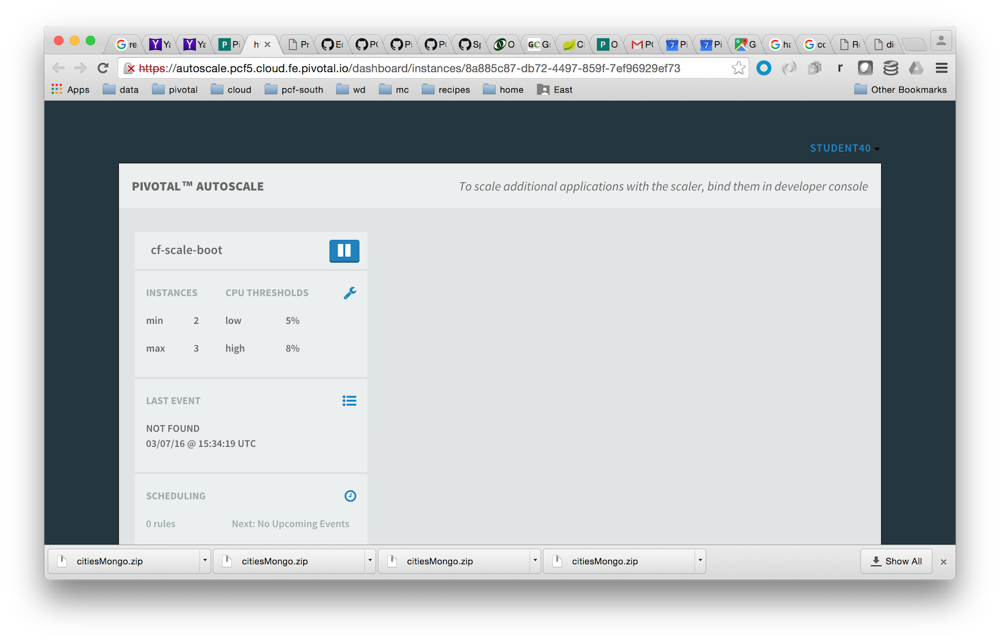
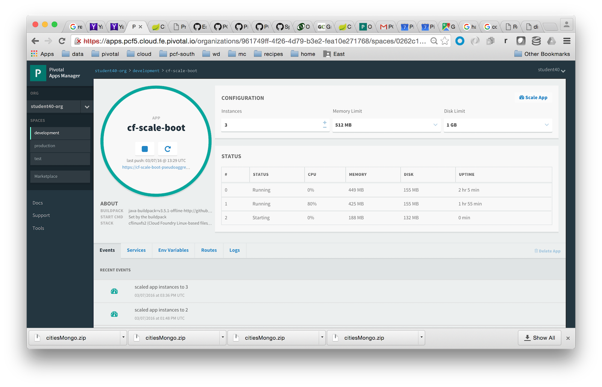

= Lab 4 - Scaling Applications

[abstract]
--
Cloud Foundry makes the work of horizontally scaling application instances and updating load balancer routing tables easy.

In this lab, we'll use a Spring Boot CLI app designed to illustrate Cloud Foundry operations such as scaling.
--

== Push the `cf-scale-boot` Application

. Change to the `cf-scale-boot` sample application directory:
+
----
$ cd $COURSE_HOME/Labs/Lab04-Scaling/cf-scale-boot
----

. Spring Boot CLI applications do not require a separate build step, so go ahead and push the application:
+
----
$ cf push
----

. Once again, this application's manifest is configured to have a random route assigned to the application.  Remeber
that an application's routes can be seen by using `cf apps` or by examining the application from the Apps Manager UI.
So, when the CLI indicates that application is up and running, visit its route in the browser:
+
image::../../Common/images/cf-scale-boot-initial.png[]
+
You'll see that the application is reporting various bits of information that it has discovered from its environment.
Of primary interest is that this application reports its _instance index_.
It also keeps track of and reports how many web requests that this instance has serviced.

== Scale the Application Up

. Now let's increase the number of running application instances to 5:
+
----
$ cf scale -i 5 cf-scale-boot
----
+
In reporting `OK`, the CLI is letting you know that the additional requested instances have been started, but they are not yet necessarily running.

. We can determine how many instances are actually running like this:
+
====
----
$ cf app cf-scale-boot
Showing health and status for app cf-scale-boot in org oreilly-class / space instructor as mstine@pivotal.io...
OK

requested state: started
instances: 5/5
usage: 512M x 5 instances
urls: cf-scale-boot-stockinged-rust.cfapps.io
last uploaded: Fri Feb 13 18:56:29 UTC 2015

     state      since                    cpu    memory           disk
#0   running    2015-02-13 12:57:10 PM   0.1%   404.8M of 512M   128.9M of 1G <1>
#1   starting   2015-02-13 03:04:33 PM   0.0%   0 of 0           0 of 0 <2>
#2   running    2015-02-13 03:04:47 PM   0.0%   398.7M of 512M   128.9M of 1G
#3   starting   2015-02-13 03:04:33 PM   0.0%   0 of 0           0 of 0
#4   starting   2015-02-13 03:04:33 PM   0.0%   0 of 0           0 of 0
----
<1> This application instance has completed the startup process and is actually able to accept requests.
<2> This application instance is still starting and will not have any requests routed to it.
====

. Eventually all instances will converge to a running state:
+
----
$ cf app cf-scale-boot
Showing health and status for app cf-scale-boot in org oreilly-class / space instructor as mstine@pivotal.io...
OK

requested state: started
instances: 5/5
usage: 512M x 5 instances
urls: cf-scale-boot-stockinged-rust.cfapps.io
last uploaded: Fri Feb 13 18:56:29 UTC 2015

     state     since                    cpu    memory           disk
#0   running   2015-02-13 12:57:10 PM   0.1%   404.8M of 512M   128.9M of 1G
#1   running   2015-02-13 03:04:51 PM   0.1%   377.5M of 512M   128.9M of 1G
#2   running   2015-02-13 03:04:47 PM   0.1%   397.3M of 512M   128.9M of 1G
#3   running   2015-02-13 03:05:03 PM   0.0%   389.2M of 512M   128.9M of 1G
#4   running   2015-02-13 03:04:52 PM   0.1%   393.4M of 512M   128.9M of 1G
----

. Revisit the application route in the browser.
Refresh several times.
You should observe the instance index and request counters changing as you do so:
+
image::../../Common/images/cf-scale-boot-scaled.png[]
+
The aforementioned http://docs.cloudfoundry.org/concepts/architecture/router.html[(Go)Router] is applying a random routing algorithm to all of the application instances assigned to this route.
As an instance reaches the `running` state, its Cell registers that instance in the routing table assigned to its route by sending a message to Cloud Foundry's message bus.
All (Go)Router instances are subscribed to this channel and register the routes independently.
This makes for very dynamic and rapid reconfiguration!

== Scale the Application Down

. We can scale the application instances back down as easily as we scaled them up, using the same command structure:
+
----
$ cf scale -i 1 cf-scale-boot
Scaling app cf-scale-boot in org oreilly-class / space instructor as mstine@pivotal.io...
OK
----

. Check the application status again:
+
----
$ cf app cf-scale-boot
Showing health and status for app cf-scale-boot in org oreilly-class / space instructor as mstine@pivotal.io...
OK

requested state: started
instances: 1/1
usage: 512M x 1 instances
urls: cf-scale-boot-stockinged-rust.cfapps.io
last uploaded: Fri Feb 13 18:56:29 UTC 2015

     state     since                    cpu    memory         disk
#0   running   2015-02-13 12:57:10 PM   0.1%   405M of 512M   128.9M of 1G
----
+
As you can see, we're back down to only one instance running, and it is in fact the original index 0 that we started with.

. Confirm that by again revisiting the route in the browser and checking the instance index and request counter:
+
image::../../Common/images/cf-scale-boot-unscaled.png[]

== Scale from the Apps Manager

.  Let's try the same scaling from the Apps Manager.  The URL of the apps manager will vary based on the PCF environment you've been assigned, but is always at `apps.[pcf-domain]` (NOTE: Your instructor provided you with this URL), ex: https://apps.mypcf.cloud.fe.pivotal.io

. Click into the `development` space
+

. You'll see the list of applications currently running in this space.  Clicking on the application route will open that application in a new browser window.  In this case, we want to work with the application configuration, so click on the application, anywhere other than the application's route. This will take you to the application's control panel.
+

. Try scaling your application up to 2 instances using the UI.  You'll see that the list of instances is displayed as you do this.
+

== App Autoscaler

.  There are many additional features available to users of Pivotal's Cloud Foundry when compared to Open Source Cloud Foundry.  These include things like Spring Cloud Services, Single Sign on for Applications, LDAP integration, Session State Caching with Gemfire, the Ops Manager, Ops Metrics, the Apps Manager - and many more.  One of these additional features includes the Application Autoscaling capability.  Let's set this up.

. Go back to the Apps Manager. 

. Click on the _Marketplace_ link, found on the left hand side navigational panel.

.  This will take you to the Services Marketplace, where a developer can self-provision various data and application services on demand.  Your environment will have a few of these services available, but you can add these, remove them, or create your own Service Brokers for internal services that you want to make available in this On Demand way.  Choose the _App Autoscaler_ from the list of options.
+

. Choose the Gold Plan and click the "Select this plan" button".  This plan examines the state of load on bound applications more frequently.
+

. Name the autoscaling service, place it in your `development` space (which is where the `cf-scale-boot` application is deployed), bind the autoscaling service to `cf-scale-boot`, and then click Add.
+

. Now you need to configure how autoscaling will behave.  After creating the autoscaling service, return to the `cf-scale-boot` application dashboard.  Go to the `Services` tab and click the _Manage_ link next to your Autoscaling service.  
+

. You will be asked to _Turn On_ Autoscaling for the `cf-scale-boot` application.  After doing so, configure it with the threshold values shown below - we are setting them very low so that we can observe the autoscaling. (Configure these settings by clicking the wrench icon)
+

. Close the Autoscaler management browser window after making your changes and return to the `cf-scale-boot` application dashboard within the Apps Manager.  Click on the `Events` tab.  
+

. There is a method in the cf-scale-boot application that will cause it to start chewing on CPU.  What you are going to do is access this URL and then switch back to the Apps Manager to view the Events tab, and see the autoscaler adding instances (and eventually retiring them when the load goes back to normal.  Access the load method now by opening `cf-scale-boot` in another browser window, and add `/load` to the URL, then hitting enter.  Don't wait for it to finish, just switch back to the Apps Manager and observe the behavior of `cf-scale-boot`
